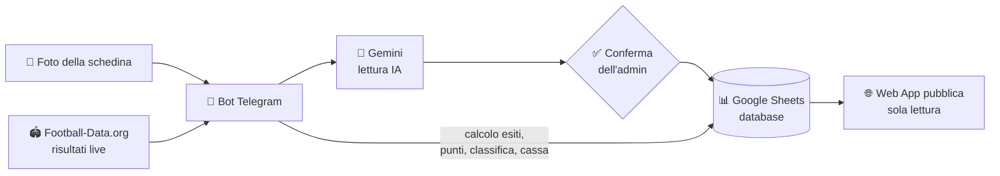

# ⚽ Toto-Amici 2026

**Torneo di pronostici sulla Serie A tra amici, completamente automatizzato.**

Sedici amici, una schedina a testa ogni giornata, 5 € di quota. Da lì in poi fa tutto il sistema: le bollette si caricano **fotografandole**, un'IA le legge, i risultati arrivano in tempo reale e classifica, punteggi e montepremi si aggiornano da soli.

<p align="center">
  
  
  
  
  
</p>

---

## Come funziona

Il cuore del sistema è un **bot Telegram** riservato all'amministratore. Le schedine arrivano come foto su WhatsApp, si inoltrano al bot, e **Gemini** le legge estraendo partite, pronostici e quote. Prima di scrivere qualsiasi cosa il bot mostra un riepilogo e aspetta una conferma umana: nessun dato entra nel database senza che una persona lo abbia validato.

Da lì in poi il sistema lavora da solo: interroga più volte al giorno l'API dei risultati, calcola gli esiti, assegna i punti secondo il regolamento, aggiorna la classifica e registra le vincite nel fondo cassa. La **web app** è la vetrina pubblica di tutto questo, in sola lettura.



> La web app **non scrive mai** sul database: l'unico componente con permessi di scrittura è il bot.

---

## Cosa si vede nella web app

| Sezione | Contenuto |
|---|---|
| **Classifica & Cassa** | Podio, classifica completa, storico per giornata, avanzamento del montepremi verso l'obiettivo |
| **Schedine Live** | La bolletta di ogni giocatore con risultati in tempo reale, esito evento per evento e vincita potenziale |
| **Confronto Giocate** | Tabella incrociata di cosa ha giocato ciascuno su ogni partita, con colori per vinto/perso e totale delle vincite potenziali |
| **Statistiche** | Hall of Fame del gruppo: il Cecchino, il Conservatore, la squadra amuleto, la squadra maledetta, Semper Fidelis e altre |
| **Coppa** | Torneo a eliminazione diretta previsto per il finale di stagione *(in arrivo)* |
| **Regolamento** | Le regole ufficiali del torneo |

---

## Il regolamento in breve

Ogni giornata si gioca **una schedina da 5 €** con una composizione obbligatoria di 10 eventi:

| Tipo | Quantità | Punti | Con quota ≥ 3.50 |
|---|:---:|:---:|:---:|
| Combo | 1 | 6 | 12 |
| Doppie Chance | 2 | 1 | 2 |
| Variabili *(Over/Under, Goal/NoGoal, Pari/Dispari)* | 3 | 2 | 4 |
| Fisse *(1, X, 2)* | 4 | 4 | 8 |
| **Bonus schedina chiusa** | — | **+10** | — |

Chi vince versa il **50% della vincita** nel fondo cassa comune, che a fine stagione viene ridistribuito come montepremi. In caso di parità in classifica, passa avanti chi ha indovinato più pronostici.

---

## Scelte tecniche

**Nessun database tradizionale.** Il "database" è un Google Sheet con tre fogli (`Giocate`, `Classifica`, `Cassa`). Sembra un compromesso, ma per un gruppo di amici è la scelta giusta: chiunque può aprire il foglio e capire cosa sta succedendo, e le correzioni d'emergenza si fanno a mano senza toccare il codice.

**Mai "vincere per default".** Se il sistema incontra un pronostico che non sa interpretare — un formato nuovo di un bookmaker, una lettura IA imperfetta — non prova a indovinare: marca l'evento come *da verificare*, non assegna punti e avvisa l'amministratore. Una schedina con eventi da verificare non può essere dichiarata chiusa né generare pagamenti.

**Difesa dai dati inaffidabili.** L'API dei risultati può temporaneamente "dimenticare" partite già concluse. Il sistema non retrocede mai un esito già confermato, monitora le anomalie e avvisa su Telegram, e consente all'amministratore di inserire un risultato a mano quando serve.

**Il bot resta reattivo.** Le operazioni lente (lettura IA, ricalcoli, scritture) girano su thread separati, così il bot risponde sempre.

---

## Stack

- **Python 3.11**
- **[Streamlit](https://streamlit.io/)** — web app, ospitata su Streamlit Community Cloud
- **[python-telegram-bot](https://python-telegram-bot.org/)** — bot, ospitato su Render
- **[Google Sheets API](https://developers.google.com/sheets/api)** — persistenza dati
- **[Google Gemini](https://ai.google.dev/)** — lettura delle schedine dalle foto
- **[Football-Data.org](https://www.football-data.org/)** — calendario e risultati Serie A
- **Flask** — endpoint di keep-alive per il servizio su Render
- **pytest** — test della logica di calcolo

---

## Struttura del progetto

```
├── app.py                    # Web dashboard Streamlit (sola lettura)
├── bot_telegram.py           # Bot Telegram: lettura IA, calcolo, scrittura dati
├── tests/                    # Test automatici della logica di calcolo
├── requirements.txt          # Dipendenze di produzione
├── requirements-dev.txt      # Dipendenze di sviluppo (test)
├── .streamlit/config.toml    # Tema chiaro/scuro della web app
├── PROJECT_LOG.md            # Storico architettura, decisioni e changelog
└── CLAUDE.md                 # Note operative per lo sviluppo assistito da IA
```

---

## Esecuzione in locale

```bash
git clone https://github.com/chrisCCtwentyone/toto-amici.git
cd toto-amici
pip install -r requirements-dev.txt
```

Servono poi le credenziali (vedi sotto), quindi:

```bash
streamlit run app.py     # web app  -> http://localhost:8501
python3 bot_telegram.py  # bot Telegram
```

### Configurazione

Nessuna credenziale è inclusa nel repository. Servono:

| Variabile | Dove si configura | A cosa serve |
|---|---|---|
| `TELEGRAM_TOKEN` | Render | Token del bot |
| `ADMIN_ID` | Render | ID Telegram dell'unico utente autorizzato |
| `SPREADSHEET_ID` | Render + Streamlit Secrets | Foglio Google usato come database |
| `FOOTBALL_DATA_KEY` | Render + Streamlit Secrets | API dei risultati |
| `GEMINI_API_KEY` | Render | Lettura IA delle schedine |
| `gcp_service_account` | Streamlit Secrets | Service account Google (JSON) |

In locale, al posto delle ultime due si possono usare i file `credenziali.json` e `chiave_api.txt`, entrambi esclusi da Git.

### Test

```bash
python3 -m pytest tests/ -v
```

Coprono normalizzazione dei pronostici, calcolo degli esiti, assegnazione dei punti e parsing degli importi in formato italiano — cioè i punti in cui il progetto ha realmente sbagliato in passato, ognuno con il suo test di regressione.

---

## Note

Progetto personale, nato per un gruppo di amici e mantenuto per divertimento. Il codice è pubblico a scopo dimostrativo: se ti è utile come spunto, prendi pure quello che ti serve.
